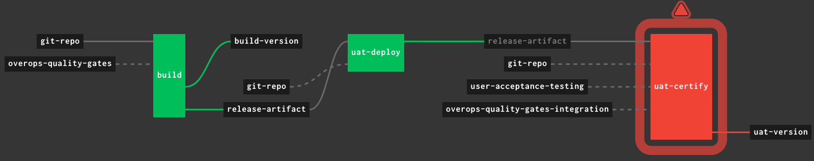

Building with Concourse
=======================

1. Create credentials file: `mv credentials.yml.sample credentials.yml`
 
2. Replace all `<readme>` parameters in `credentials.yml`
 
3. Set the pipeline: `fly -t tutorial set-pipeline -c concourse-ci/pipeline.yml -p shopping-cart -l "concourse-ci/credentials.yml"`
 
4. Unpause the pipeline: `fly -t tutorial unpause-pipeline -p shopping-cart`
 
5. Start a build: `fly -t tutorial trigger-job -j shopping-cart/build`
